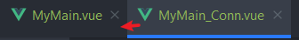

# Vue - 组件通信

## 概述
父子组件之间不能相互访问data内容，需要使用如下手段：


## 父传子

 本例子中：App.vue（父）MyMain(子）MyMain_Conn(孙）

方法是在父组件中包含的子组件标签上写`msg="文本"`或者`:chat="父组件变量"`
由此，msg和chat可以当做子组件自身的变量使用之（插值、计算或者方法调用）

**App.vue**

```html
<template>
	<div>
        <my-main chat="abc" :doctrine="fatherDoctrine" :goodList="fatherGoodList" ></my-main>
    </div>
</template>
```

**MyMain.vue**中的`script`域:

```javascript
  props: {
    chat:{
      type:String,
      required:true
    },
    proverb:{
      type:String
    
    doctrine:{
      :String,
      default:'#####'
    },
   goodList: {
      type: Array
    }
  }
```
2.如果父传子的属性是对象等，则情况稍微复杂些，在子组件的vue实例中这样书写：
* chat为字符串型，且建议传递（否则控制台报warning)
* proverb为字符串型
* doctrine为字符串型，如果不传递显示默认值
* goodList为对象数组型，结合v-for显示之 

子组件的显示
```html
<template>
  父组件传过来的：{{ chat }};{{ proverb }};{{doctrine}}<br>
  组件本身的消息：{{ msg }}<br>
  {{ showChat() }}<br>
  父组件传递对象数组:<br>
  <ul>
    <li v-for="item in goodList">{{item.id}}-{{item.name}}-{{item.price}}</li>
  </ul>
  <MyMain_Conn :childGoods="goodList"></MyMain_Conn>
</template>
```

**注意：父组件在子组件标签内供传递的属性名应该与子组件props接收的名称保持一致**

同理，子组件接收到父组件传递过来的属性键值后，也可以以同样的方式传递给孙组件


3.如果想让父组件往子组件内传递**函数**并携带参数,可以这么做

父组件

```html
<template>
	<div>
        <child :myMethod="fatherMethod"></child>
    </div>
</template>
<script>
import child from './child.vue'
export default {
    components:{
      child  
    },
	data(){
        return {
            payload:{
                 msg: 'chocalate',
                 num: 100
            }
        }
    },
    methods:{
        fatherMethod(){
            return this.payload
        }
    }
}
</script>
```

子组件

```html
<template>
	<div>
        {{myMethod()}}
    </div>
</template>
<script>
export default{
	props:[
        myMethod:{
        	type:Function
        }
    ]
}
</script>
```


## 子传父



子组件传递数据给父组件需要利用事件冒泡机制，即先在子组件的方法内使用$emit方法创建一个事件，传入名称和要传递的数据
,num为子组件data域中的变量，可以根据具体情况自由变化
MyMain_conn.vue

```js
methods:{
    changeNum(){
      this.$emit('myCountEvent',this.num);
    }
  }
```
然后在父组件创建子组件标签的位置使用v-on绑定子组件创建的事件到自己的一个方法上，这个方法将自动引入子组件传递来的数据
MyMain.vue
```html
<template>
    <div class="myMainStyle">子组件点击次数：{{counter}}</div>
    < @myCountEvent="getChildNum"></MyMain_Conn>
</template>
<script>
import MyMain_Conn from "./ChildComponents/MyMain_Conn";
export default {
  name: "MyMain",
  components: {
    MyMain_Conn
  },
  data() {
    return {msg: 'bonjour!',counter:0}
  },
  methods: {
    getChildNum(data){
      this.counter += data;
    }
  }
}
</script>
```
当点击子组件的按钮时它将调用`changeNum`方法创建事件`myCountEvent`并且传递自身的变量num过去，由此父组件累加数字并显示出来