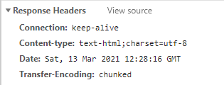
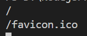
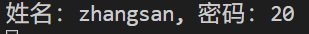
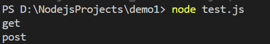
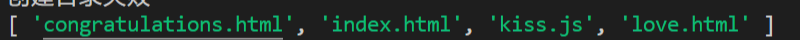
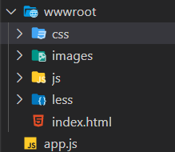
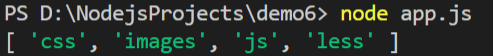
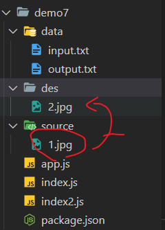

# Nodejs入门基础

## http模块、url模块、supervisor

### 工具

使用vscode的`node-snippets`插件直接输入`server`快速创建一个http服务器

```javascript
//引入http模块

var http = require('http');

//创建一个web服务

http.createServer(function (request, response) {

 //request:获取url传过来的信息

 //response：给浏览器相应信息

 response.writeHead(200, {'Content-Type': 'text/plain'}); //设置响应头

 response.end('Hello World'); //给页面输出一句话且结束相应

}).listen(8081); //nodejs服务器运行的端口：8081

//提示

console.log('Server running at http://127.0.0.1:8081/');
```

简化并且分解这个过程，首先使用`common js`的语法导入http模块，设置为不可变

```
const http = require('http')
```

使用http模块的api创建一个服务器`http.createServer`，接收两个参数可以写为req和res

获取浏览器发送过来的url`  console.log(req.url); //获取url`

给浏览器设置响应头:`res.writeHead(200, {"Content-type":"text-html;charset=utf-8"});`

给浏览器打印信息，并且结束响应体

`res.write('this is NodeJS!');`

 `res.end();`

> 如果不调用end方法，浏览器端将会假死

在这个函数体结束时可以使用`listen()`设置端口号

可以看到浏览器请求了两次,且已经获取到了响应体




服务器端打印



如果在浏览器输入`http://localhost:8081/abc`

服务器将会打印

###  编码

响应头中的编码应该与页面编码一致，如我们这里统一为`utf-8`则需要在response使用write方法输出内容前加上

`res.write('<head><meta charset="utf-8"/></head>')`设置头信息

则可以正常打印中文

\### 获取get方法传递过来的明参

使用require方法加载url模块，其中的parse方法可以解析请求体，

例如：api为`http://www.baidu.com?name=zhangsan&password=123` 默认解析为：

```javascript
Url {

 protocol: 'http:',

 slashes: true,

 auth: null,

 host: 'www.baidu.com',

 port: null,

 hostname: 'www.baidu.com',

 hash: null,

 search: '?name=zhangsan&password=123',

 query: 'name=zhangsan&password=123',

 pathname: '/',

 path: '/?name=zhangsan&password=123',

 href: 'http://www.baidu.com/?name=zhangsan&password=123'

}
```


传入第二个参数为true,则可以将query转化为对象格式，然后就可以自由操作了：

```js

const url = require('url');

let api = 'http://www.baidu.com?name=zhangsan&password=123';

let temp = url.parse(api,true).query;

console.log(temp);

console.log(`姓名：${temp.name}, 密码：${temp.password}`);

```

服务器控制台输出：



### supervisor插件

如果我们想要热更新服务器程序（每次不必使用`node app.js`重启，则需要一个工具来监控文件的变化

需要全局安装`npm install -g supervisor`

然后使用`supervisor app.js`启动服务器主程序，这时候再次修改代码修改代码后就可以立即生效了（response发送的内容仍然需要刷新）

## CommonJS和Nodejs自定义模块

### 模块封装

我们可以把公共的功能封装成一个单独的js作为一个模块，然后使用`exports`或者module.exports暴露属性或者方法：

在需要使用这些模块的文件中使用`require`方法直接引入即可：

新建模块**./node_modules/axios/index.js**

1.作为直接子方法或者变量导出

> 提示，如果在根目录的node_modules下新建文件夹且入口为index.js，则导入直接写模块名即可

axios/index.js

```js

exports.get = ()=>{

  console.log('get');

};

exports.post = ()=>{

  console.log('post');

}

```

./test.js 

```js

let axios = require('axios/');

axios.get();

axios.post();

```

2.作为子模块导出

axios/index.js

```js

let obj = {

  get :() => {

​    console.log('get');

  }

  ,

  post : () => {

​    console.log('post');

  }

}

exports.myObj = obj;

```

./test.js 

```

let axios = require('axios');

axios.myObj.get();

axios.myObj.post();

```

上述两种方法输出结果均为：



### 修改模块主入口

在axios文件夹下打开终端，输入`npm init --yes`强制生成`package.json`

package.json

```json

{

 "name": "axios",

 "version": "1.0.0",

 "description": "",

 "main": "index.js",

 "scripts": {

  "test": "echo \"Error: no test specified\" && exit 1"

 },

 "keywords": [],

 "author": "",

 "license": "ISC"

}

```

在这里可以修改模块的默认入口 ` "main": "index.js"` 则可以加载非`index.js`的其他名称来导入自定义模块

## npm：通用包管理工具

`npm -v` 查看当前npm版本
`npm install 模块名 --save` 以生产模式安装包

`npm uninstall 模块名` 卸载包
`npm list`查看当前项目已经安装的包

`npm info 模块名`查看包的相关信息

```
npm install 模块名@版本号
```

> `npm install jquery@next`安装测试版

## 管理

### 原生fs - 管理文件目录

引入模块`const fs = require('fs');`

* 查看文件状态

```js

 fs.stat('./html', (err, data) => {

  if(err){

    console.log(err);

   return;

 }

   console.log(`是文件:${data.isFile()}`);

   console.log(`是文件:${data.isDirectory()}`);

 });

```

* 创建目录

```js

fs.mkdir('./css', (err)=>{

  if(err){

    console.log('创建目录失败');

  }else{
    console.log('创建成功');

  }

});

```

* 写入文件内容（没有则创建）

```js

 fs.writeFile('./html/index.html','你好nodejs', (err)=>{

   if(err){

     console.log(err);

     return;

   }

  console.log('创建写入文件成功');

});

```

* 追加文件内容（没有则创建）

```js

fs.appendFile('./css/base.css','\n#dude{color:white}',(err)=>{

   err ? console.log('追加失败') : console.log('追加成功');

 });

```

* 读取文件

```js

fs.readFile('./html/index.html',(err,data)=>{

  if(err){

​    console.log('读取文件失败！');

  }else{

​    console.log(data.toString()); //将16进制转化为字符串显示

  }

})

```


* 读取指定目录的子节点（文件+目录）

```

fs.readdir('./html',(err,data)=>{

  if(err){

​    console.log('读取失败');

  }else{

​    console.log(data);

  }

});

```



* 移动文件并改名

```js

fs.rename('./css/reset.scss', './html/index.css', (err)=>{

  if(err){

​    console.log('移动失败');

  }else{

​    console.log('移动成功');

  }

});

```

例子：查看指定目录是否存在，如果无则创建指定目录

```js

const fs = require('fs');

let path = './upload';

fs.stat(path, (err, data) => {

  if (err) {

​    //无指定文件或目录存在，创建新目录

​    makeDir(path);

​    return;

  }

  if (data.isDirectory()) {

​    //是目录

​    console.log('存在同名目录');

​    return;

  } else if(data.isFile()){

​    //是文件

​    console.log('存在同名文件');

​    fs.unlink(path, (err) => {

​      if (!err) {

​        //删除成功

​        makeDir(path);

​      } else {

​        console.log('检查传入的文件名是否合法');

​      }

​    });

  }

});

function makeDir(dir) {

  fs.mkdir(dir, (err) => {

​    if(err){

​      console.log('创建目录失败');

​    }else{

​      console.log('创建目录成功');

​    }

​    return;

  });

}

```

### mkdir插件

安装`npm install mkdir --save`

使用其文档指定方式创建目录，如果已存在将不会有任何操作

```js

const mkdirp = require('mkdirp')

mkdirp('./tmp/foo/bar/baz/1.js').then(made =>

console.log(`made directories, starting with ${made}`))

```

### 使用async和await（ES7+)

请看：ES6异步处理

结合前述学习的方法，筛选指定目录下的目录并打印



一般方法：

```js
var fs = require('fs');
var path = './wwwroot';
var dirArr = [];
//只把目录筛选出来
fs.readdir(path, (err, data) => {
    if (err) {
        console.log('读取目录结构失败');
        return;
    }
    //递归解决
    (function getDir(i) {
        if (i == data.length) {
            //执行完成 退出递归
            console.log(dirArr);
            return;
        }
        fs.stat(path + '/' + data[i], (err, stat) => {
            if (err) {
                console.log('子目录获取失败！');
                return;
            }
            // console.log('push');
            if (stat.isDirectory()) {
                dirArr.push(data[i]);
            }
            getDir(i + 1);
        })
    })(0);
})

```



* async关键字：修饰的函数内部有异步操作
* await关键字：等待异步方法执行完成

async和await常用来组合处理异步操作，实质上是generator函数的语法糖，可以用来解决**回调地狱**等问题

注意点：

* 只有在async修饰的函数内部才能用await关键字接收异步函数的返回的结果
* await会先等待要接收的异步函数结果（成功的结果，就是resolve函数传入的值），然后跳出async函数执行主线程任务，最后再回到async函数
* 多个await操作并发执行，可以使用`Promise.all`方法处理


> 在javascript中，执行顺序的优先级为：主线程>微任务（promise的then）>宏任务（setTimeOut等计时器），同样类型的任务依次加入队列，然后顺序执行


例子：指定多少毫秒后输出一个值

```javascript
function timeout(ms) {
  return vnew Promise((resolve) => {
    setTimeout(resolve, ms);
  });
}

async function asyncPrint(value, ms) {
  await timeout(ms);
  console.log(value)
}

asyncPrint('hello world', 50);
```

> await 命令后面的 Promise 对象，运行结果可能是 rejected，所以最好把 await 命令放在 try...catch 代码块中。


### fs流以及管道流 - 操作文件或图片内容

fs流相当于在代码间向文件创建了一个管道以分批次读取或者写入内容，因此需要先指定详细位置：

#### 单向

* 读取文件数据 `fs.createReadStream`

例子：读取根目录下`data`文件夹中的指定文本：

```js
const fs = require('fs');
let readStream = fs.createReadStream('./data/input.txt');
let count = 0;
let str = '';
readStream.on('data', (data) => {
    str += data;
    count++;
});
readStream.on('end', () => {
    console.log(str);
    console.log(count);
});
readStream.on('error', (err)=>{
   console.log(err); 
});
```

> 读取次数的多少跟大小有关 >0

* 写入文件数据 `fs.writeStream`

例子：向根目录下`data`目录中创建新文件并写入内容

```js
const fs = require('fs');
let str = '';
for (let index = 0; index < 500; index++) {
    str+='我是一个普通的数据';
}
let writeStream = fs.createWriteStream('./data/output.txt');
writeStream.write(str);
//标记文件末尾
writeStream.end();
//标记写入完成
writeStream.on('finish', ()=>{
    console.log('写入完成！');
});
```

#### 双向

* 复制文件

复制图片到指定位置

```js
const fs = require('fs');
let readStream =  fs.createReadStream('./source/1.jpg');
let writeStream = fs.createWriteStream('./des/2.jpg');
readStream.pipe(writeStream);
```



